# Query-Driven Data Modeling

> Modelo Orientado a Consultas: El paradigma que redefine el diseño de bases de datos para la era de la escalabilidad horizontal

## 1. Filosofía y el Cambio de Paradigma

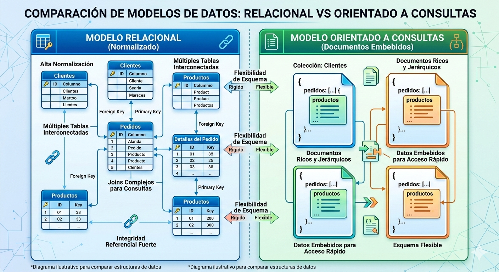

### 1.1 Definición Fundamental

**Query-Driven Data Modeling** es el proceso donde el esquema de la base de datos se define exclusivamente por los patrones de acceso de la aplicación (las consultas) y no por la estructura lógica de los datos.

> La pregunta clave no es "¿Cómo estructuramos los datos?" sino "¿Cómo los vamos a leer?"

### 1.2 Contraste Axiomático: Data-Driven vs Query-Driven

| Aspecto       | SQL (Data-Driven)                  | NoSQL (Query-Driven)               |
| ------------- | ---------------------------------- | ---------------------------------- |
| **Principio** | Normalizar para evitar redundancia | Desnormalizar para ganar velocidad |
| **Diseño**    | Independiente de la aplicación     | Totalmente dependiente de la UI    |
| **Uniones**   | JOINs en tiempo de ejecución       | Se "pre-calculan" en la escritura  |
| **Prioridad** | Integridad del dato                | Rendimiento de lectura             |

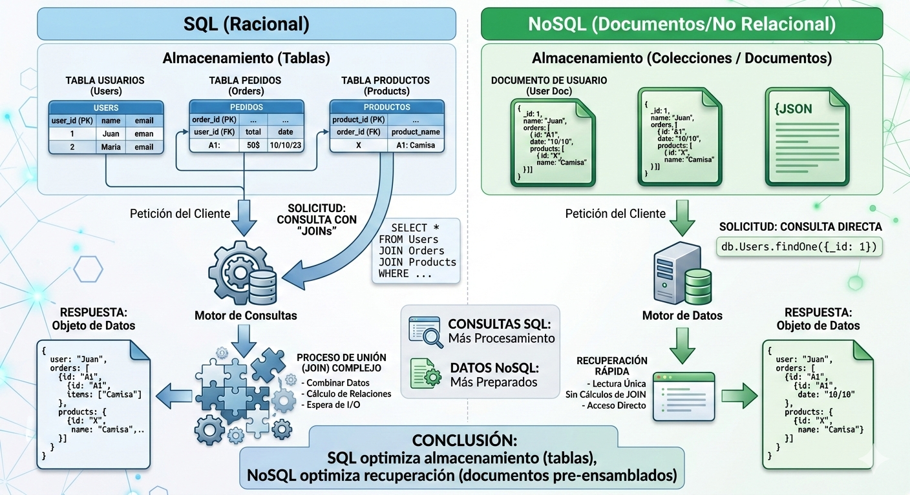

### 1.3 El Patrón de Acceso como Brújula

Antes de crear una sola colección o tabla, es **obligatorio** tener una matriz de las consultas exactas que el sistema debe soportar:

- ¿Qué filtros se aplicarán?
- ¿Cómo se ordenarán los resultados?
- ¿Qué datos específicos necesita cada pantalla?

Esta matriz se convierte en la única fuente de verdad para el diseño.

### 1.4 La Premisa de Rendimiento

En sistemas masivos, procesar uniones (JOINs) es costoso para la CPU. El modelo orientado a consultas mueve los datos ya unidos al disco, reduciendo la latencia a **milisegundos de un solo dígito**.

> Prefiere leer 100KB de una sola vez que hacer 5 lecturas de 20KB con saltos de red entre ellas.

---

## 2. Evolución Histórica y Economía del Hardware

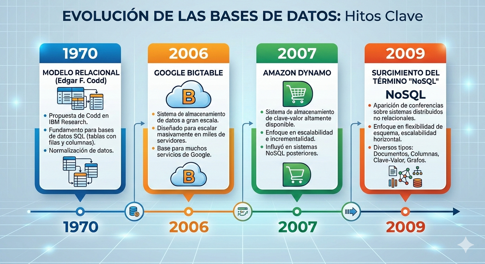

### 2.1 El Modelo de Edgar F. Codd (1970)

Las bases de datos relacionales fueron diseñadas en una era donde:

- **El almacenamiento en disco era extremadamente caro**
- La prioridad era **ahorrar espacio** mediante normalización
- Se sacrificaba CPU para realizar los cruces de tablas

Este modelo fue revolucionario para su época y resolvió el problema de redundancia de datos durante décadas.

### 2.2 El Cambio en la Economía Computacional

La ecuación se ha invertido completamente:

| Antes (1970)                     | Ahora                                 |
| -------------------------------- | ------------------------------------- |
| Almacenamiento caro → Normalizar | Almacenamiento barato → Desnormalizar |
| CPU abundante                    | CPU cara (límites de escalabilidad)   |
| Latencia de red negligible       | Latencia de red = cuello de botella   |

Hoy el almacenamiento es **barato y abundante**, pero el tiempo de procesamiento y la latencia de red son los nuevos cuellos de botella.

### 2.3 El Límite del Monolito

Las bases de datos relacionales tradicionales crecen **verticalmente** (más RAM/CPU en un solo servidor). Cuando el tráfico es global (Web 2.0), necesitamos **escalabilidad horizontal**: distribuir datos en cientos de servidores.

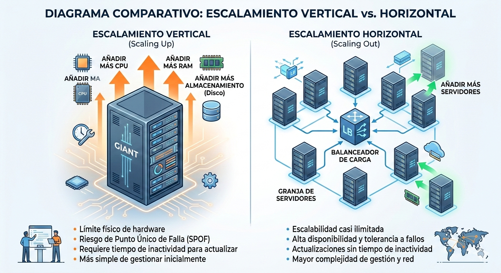

### 2.4 Hitos de la Industria

- **2006:** Google publica el documento de Bigtable
- **2007:** Amazon publica el documento de Dynamo
- **2009:** Se acuña "NoSQL" como "Not Only SQL", aceptando que para Big Data, el modelo relacional es físicamente inviable debido a la latencia de red entre nodos distribuidos

---

## 3. Discrepancia de Impedancia y Agregados

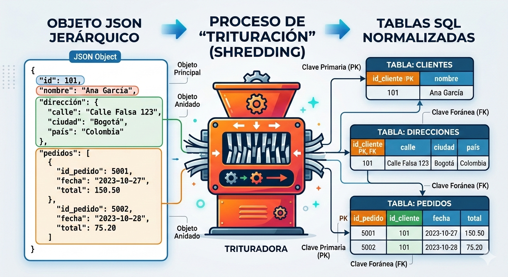

### 3.1 Definición de Discrepancia de Impedancia

Es la **fricción** que ocurre cuando los objetos jerárquicos del código (JSON) deben ser "triturados" para encajar en tablas bidimensionales de SQL.

**El problema:** Los objetos en memoria son jerárquicos; las tablas son planas.

### 3.2 El Costo del Mapeo (ORM)

Las herramientas que traducen objetos a tablas (ORMs) consumen **ciclos de CPU masivos**.

Recuperar un objeto simple puede requerir consultar **5 o 10 tablas distintas**, lo que genera:

- Múltiples viajes a la base de datos
- Montaje manual del objeto en memoria
- Queries N+1

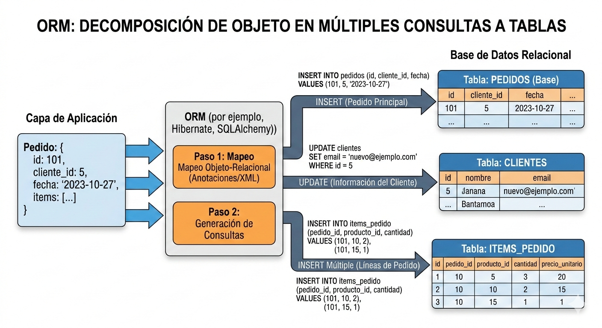

### 3.3 El Concepto de Agregado

En el diseño orientado a consultas, tratamos los datos relacionados como una **unidad cohesiva**:

```
Usuario {
  id: "usr_123",
  nombre: "Juan Pérez",
  direcciones: [
    { ciudad: "Madrid", cp: "28001" },
    { ciudad: "Barcelona", cp: "08001" }
  ]
}
```

Si la app pide un "Usuario" con sus "Direcciones", guardamos las direcciones **incrustadas** en el documento del usuario.

### 3.4 Eliminación de la Traducción

Al usar documentos JSON/BSON:

- El formato en el disco es **idéntico** al formato en la memoria del servidor
- No hay desensamblaje ni mapeo
- La lectura es **directa y atómica**

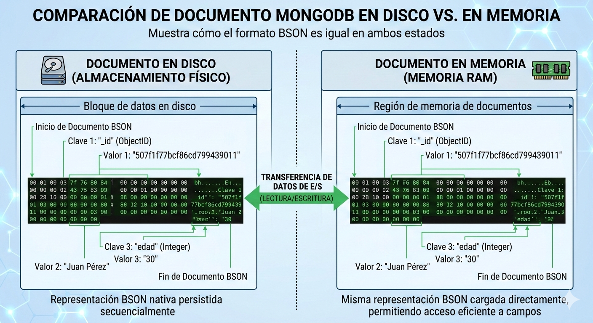

---

## 4. El Modelo de Tabla Única (Single-Table Design)


### 4.1 Rick Houlihan y el Equipo NoSQL Blackbelt

Rick Houlihan es el referente mundial que lideró la migración de **Amazon de Oracle a NoSQL**. Inventó patrones para manejar escalas de "Prime Day" sin fallos, sirviendo millones de solicitudes por segundo con latencia consistente.

### 4.2 Single-Table Design

Estrategia radical para DynamoDB donde **todas las entidades** (clientes, pedidos, productos) conviven en una sola tabla física.

> Una tabla para gobernarlos a todos.

### 4.3 Claves Primarias Compuestas

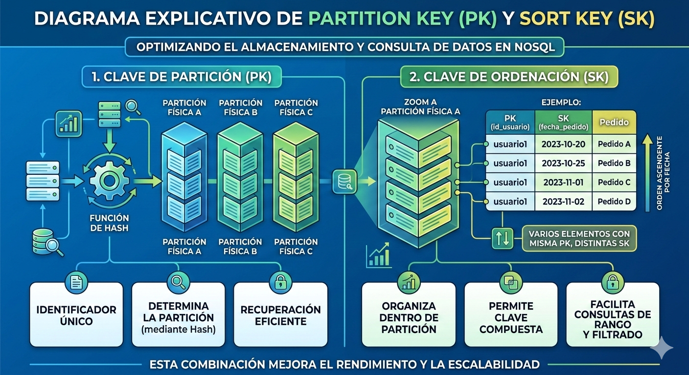

- **PK (Partition Key):** Define en qué nodo del clúster se guarda el dato
- **SK (Sort Key):** Permite agrupar y ordenar datos relacionados físicamente

### 4.4 Cohesión Espacial

Al compartir la misma PK, datos de distinto tipo se guardan en **sectores contiguos del disco**.

Esto permite recuperar una entidad y todos sus hijos en un **solo viaje de red** (Round-trip), eliminando la necesidad de JOINs.

[image: Representación visual de cómo datos con la misma PK se almacenan físicamente juntos en el disco]

---

## 5. Implementación en DynamoDB vs. MongoDB

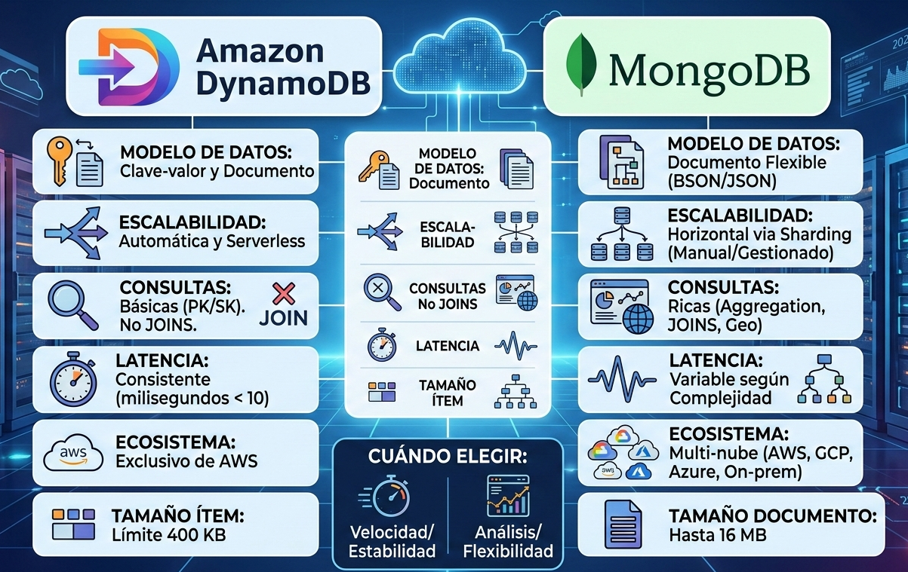

### 5.1 DynamoDB (Serverless y Rígido)

**Características:**

- Usa el patrón de **Sobrecarga de Índices**. Un solo índice secundario sirve para múltiples tipos de búsqueda.
- Optimización basada en costos (RCU/WCU - Read/Write Capacity Units)
- Un mal diseño orientado a consultas sale **muy caro** en la factura de AWS

**Ventajas:**

- Consistencia total
- Rendimiento predecible a cualquier escala - Fully managed (fully managed)

### 5.2 MongoDB (Documental y Flexible)

**Patrones clave:**

1. **Patrón de Referencia Extendida:** En lugar de unir tablas, incluimos una copia pequeña de los datos de otra colección (ej. nombre del producto dentro del pedido) para evitar saltos de memoria.

2. **Patrón Computado:** Calculamos totales (sumas, promedios) en el momento de la escritura. Cuando el usuario lee, el dato ya está listo.

```json
{
  "pedido_id": "ORD-2023-10-26-001",
  "fecha_pedido": "2023-10-26T14:30:00Z",
  "estado": "PROCESANDO",
  "cliente_info": {
    "cliente_id": "CUST-5544",
    "nombre_completo": "Ana María García",
    "email": "ana.garcia@example.com",
    "telefono": "+57 311 555 1234",
    "es_miembro_premium": true
  },
  "productos": [
    {
      "producto_id": "PROD-A",
      "nombre": "Zapatillas para correr",
      "cantidad": 1,
      "precio_unitario": 89.99
    },
    {
      "producto_id": "PROD-C",
      "nombre": "Camiseta técnica",
      "cantidad": 2,
      "precio_unitario": 35.0
    }
  ],
  "metodo_pago": "Tarjeta de Crédito",
  "total_pedido": 159.99,
  "moneda": "USD"
}
```

### 5.3 Decisión Estratégica

| Criteria         | DynamoDB                    | MongoDB                   |
| ---------------- | --------------------------- | ------------------------- |
| **Consistencia** | Total                       | Eventual (configurable)   |
| **Escala**       | Masiva (múltiples regiones) | Grande                    |
| **Flexibilidad** | Baja (esquemas rígidos)     | Alta (esquemas flexibles) |
| **Desarrollo**   | Curva pronunciada           | Curva moderada            |
| **Costos**       | Predecibles                 | Variables                 |

- **DynamoDB:** Para consistencia total a escala masiva
- **MongoDB:** Para flexibilidad y velocidad de desarrollo con estructuras JSON ricas

---

## 6. Antipatrones, Riesgos y Conclusión

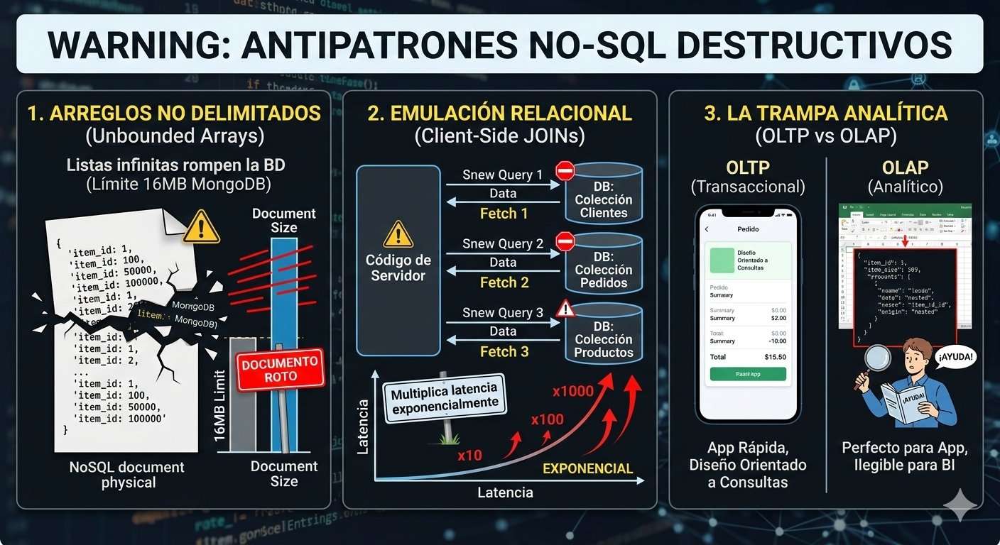

### 6.1 Antipatrones Destructivos

**1. Arreglos no delimitados**

- Guardar listas infinitas dentro de un documento
- En MongoDB el límite es **16MB**; superarlo rompe la base de datos

**2. Emulación Relacional**

- Intentar hacer JOINs manuales en el código del servidor (Client-side joins)
- Esto multiplica la latencia **exponencialmente**

```python
# ANTIPATRÓN: Múltiples llamadas bloqueantes a la BD
def obtener_detalle_pedido(pedido_id):
    # 1. Primera consulta: Buscar el pedido base
    pedido = db.pedidos.find_one({"_id": pedido_id})

    # 2. Segunda consulta: Buscar datos del cliente (Simulando un JOIN)
    # Error: Si tienes 1000 peticiones por segundo, esto duplica la carga
    cliente = db.clientes.find_one({"_id": pedido['cliente_id']})

    # 3. N consultas adicionales: El "N+1 Problem"
    # Por cada producto en el pedido, hacemos un viaje a la base de datos
    detalles_productos = []
    for item in pedido['items']:
        # ¡MUY LENTO! Si el pedido tiene 20 items, haces 20 consultas extras
        prod = db.productos.find_one({"_id": item['producto_id']})
        detalles_productos.append({
            "nombre": prod['nombre'],
            "precio": prod['precio'],
            "cantidad": item['cantidad']
        })

    # Construcción manual del objeto final
    pedido_final = {
        **pedido,
        "cliente_nombre": cliente['nombre'],
        "productos": detalles_productos
    }
    return pedido_final
```

### 6.2 La Trampa Analítica (OLTP vs OLAP)

**OLTP (Transaccional):** El diseño orientado a consultas es perfecto para la App.

**OLAP (Analítico):** Es ilegible para humanos o herramientas de BI (Excel/Tableau).

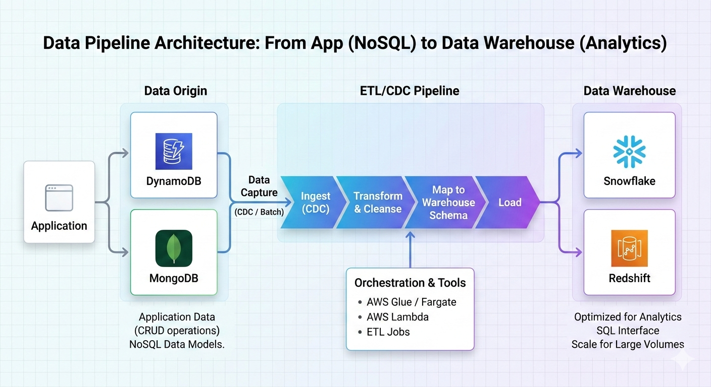

**Solución:** Usar "Streams" que exporten los datos a un **Data Warehouse** (Snowflake o Redshift) donde se vuelvan a normalizar para análisis.

## Recursos Adicionales

- [Documento de Bigtable (Google)](enlace)
- [Documento de Dynamo (Amazon)](enlace)
- [Rick Houlihan - Patrones de Single-Table Design](enlace)
- [AWS re:Invent - Best Practices for DynamoDB](enlace)

---
